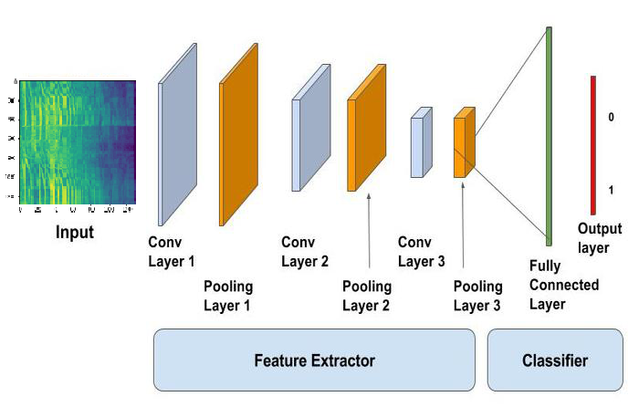

# Classification-of-Environmental-Sound-using-Deep-Learning
The ESC-50 dataset is a labeled collection of 2000 environmental audio recordings suitable for benchmarking methods of environmental sound classification.  The dataset consists of 5-second-long recordings organized into 50 semantical classes (with 40 examples per class) loosely arranged into 5 major categories:
The **ESC-50 dataset** is a labeled collection of 2000 environmental audio recordings suitable for benchmarking methods of environmental sound classification.

The dataset consists of 5-second-long recordings organized into 50 semantical classes (with 40 examples per class) loosely arranged into 5 major categories:

| Animals | Natural soundscapes & water sounds  | Human, non-speech sounds | Interior/domestic sounds | Exterior/urban noises |
| :--- | :--- | :--- | :--- | :--- |
| Dog | Rain | Crying baby | Door knock | Helicopter |
| Rooster | Sea waves | Sneezing | Mouse click | Chainsaw |
| Pig | Crackling fire | Clapping | Keyboard typing | Siren |
| Cow | Crickets | Breathing | Door, wood creaks | Car horn |
| Frog | Chirping birds | Coughing | Can opening | Engine |
| Cat | Water drops | Footsteps | Washing machine | Train |
| Hen | Wind | Laughing | Vacuum cleaner | Church bells |
| Insects (flying) | Pouring water | Brushing teeth | Clock alarm | Airplane |
| Sheep | Toilet flush | Snoring | Clock tick | Fireworks |
| Crow | Thunderstorm | Drinking, sipping | Glass breaking | Hand saw |

# Download Dataset
Each sound is 5 second long, this project change it to 10 second long i.e. double the duration of each sound.
Please go to this link for more details from here:
https://github.com/karoldvl/ESC-50 

# Explain Dataset (Presprocessing)
- [`audio/*.wav`](audio/)

  2000 audio recordings in WAV format (5 seconds, 44.1 kHz, mono) with the following naming convention:
  
  `{FOLD}-{CLIP_ID}-{TAKE}-{TARGET}.wav`
  
  - `{FOLD}` - index of the cross-validation fold,
  - `{CLIP_ID}` - ID of the original Freesound clip,
  - `{TAKE}` - letter disambiguating between different fragments from the same Freesound clip,
  - `{TARGET}` - class in numeric format [0, 49].

- [`meta/esc50.csv`](meta/esc50.csv)

  CSV file with the following structure:
  
  | filename | fold | target | category | esc10 | src_file | take |
  | :--- | :--- | :--- | :--- | :--- | :--- | :--- |
  
  The `esc10` column indicates if a given file belongs to the *ESC-10* subset (10 selected classes, CC BY license).
  
- [`meta/esc50-human.xlsx`](meta/esc50-human.xlsx)

  Additional data pertaining to the crowdsourcing experiment (human classification accuracy).
  
-  So from there one can easily create the dataset based on input (.wav) and its corresponding target(class in numeric format[0,49]).

- [`Example`]:
  - 1-16746-A-15.wav ~ class 15
  - 1-18631-A-23.wav ~ class 2 and so on.
- Also one can get the category name as well as from the meta/esc50.csv. 
where [0,49] are the class in numeric format and there target.
   - {0: 'dog', 1: 'rooster', 2: 'pig', 3: 'cow', 4: 'frog', 5: 'cat', 6: 'hen', 7: 'insects', 8: 'sheep',
 9: 'crow', 10: 'rain', 11: 'sea_waves', 12: 'crackling_fire', 13: 'crickets',
 14: 'chirping_birds', 15: 'water_drops', 16: 'wind', 17: 'pouring_water', 18: 'toilet_flush',
 19: 'thunderstorm', 20: 'crying_baby', 21: 'sneezing', 22: 'clapping', 23: 'breathing',
 24: 'coughing', 25: 'footsteps', 26: 'laughing', 27: 'brushing_teeth', 28: 'snoring',
29: 'drinking_sipping', 30: 'door_wood_knock', 31: 'mouse_click', 32: 'keyboard_typing',
 33: 'door_wood_creaks', 34: 'can_opening', 35: 'washing_machine', 36: 'vacuum_cleaner',
 37: 'clock_alarm', 38: 'clock_tick', 39: 'glass_breaking', 40: 'helicopter', 41: 'chainsaw',
 42: 'siren', 43: 'car_horn', 44: 'engine', 45: 'train', 46: 'church_bells', 47: 'airplane', 48: 'fireworks',
 49: 'hand_saw'}
 
 # Algorithm
- A paper I found http://karol.piczak.com/papers/Piczak2015-ESC-ConvNet.pdf, from there itself I follow the steps. So here the author did the same application of CNN is image classification, where a fixed dimension image is fed into a network along with different channels (RGB in the case of a color image) and after various steps of convolution, pooling and fully connected layers, network outputs class probabilities for the image. I want to do the same, but here instead of an image, I have sound clips.
- Although deep learning eliminates the need for hand-engineered features, I have to choose a representation model for the data. Instead of directly using the sound file as an amplitude vs time signal authors use a  log scaled mel-spectrograms and their corresponding deltas from a sound clip. Regarding fixed size input, then divide each sound clip into segments of 60x41 (60 bands and 41 frames). Log-scaled mel-spectrograms were extracted from all recordings (resampled to 22050 Hz and normalized) with window size of 1024, hop length of 512 and 60 mel-bands.
- There is a fact that human ear hears sound on log-scale,and closely scaled frequency are not well distinguished by the human Cochlea. The effect becomes stronger as frequency increases. Hence only take into account power in different frequency bands. The mel-spec and their deltas will become two channels, which will be fed into CNN. 
- Here I use “librosa” is a python package for music and audio analysis. It provides the building blocks necessary to create music information retrieval systems. windows and extract_feature are the two methods we need to prepare the data (both features and labels) for CNN. 
- Iterate over file the folder but as you mentioned in the description that each sound is 5 second long, I need to replicate it to make 10 second long i.e. double the duration of each sound. That will be taken care by extracte_feature methods and then calculate above-mentioned features along with class labels and append them to arrays.
- Now the audio file is represented as a 60(bands) x 41(frames) x 2(channel) spectrogram image.

# Block diagram

* Convolutional input layer, 32 feature maps with a size of 3×3 and a rectifier activation function.
* Dropout layer at 20%.
* Convolutional layer, 32 feature maps with a size of 3×3 and a rectifier activation function.
* Max Pool layer with size 2×2.
* Convolutional layer, 64 feature maps with a size of 3×3 and a rectifier activation function.
* Dropout layer at 20%.
* Convolutional layer, 64 feature maps with a size of 3×3 and a rectifier activation function.
* Max Pool layer with size 2×2.
* Convolutional layer, 128 feature maps with a size of 3×3 and a rectifier activation function.
* Dropout layer at 20%.
* Convolutional layer,128 feature maps with a size of 3×3 and a rectifier activation function.
* Max Pool layer with size 2×2.
* Flatten layer.
* Dropout layer at 20%.
* Fully connected layer with 1024 units and a rectifier activation function.
* Dropout layer at 20%.
* Fully connected layer with 512 units and a rectifier activation function.
* Dropout layer at 20%.
* Fully connected output layer with 50 units and a softmax activation function.

* Fit and evaluate this model using A logarithmic loss function is used with the stochastic gradient descent optimization algorithm configured with a large momentum and weight decay start with a learning rate of 0.01.
Epochs 300 batch size of 50.
* After training if we plot the loss and accuracy curve, we can see that there is a considerable difference between the training and validation loss. This indicates that the network has tried to memorize the training data and thus, is able to get better accuracy on it. This is a sign of Overfitting. But we have already used Dropout in the network, then why is it still overfitting.
